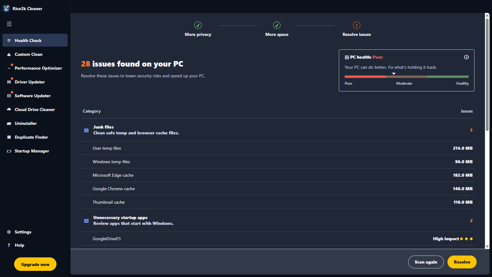
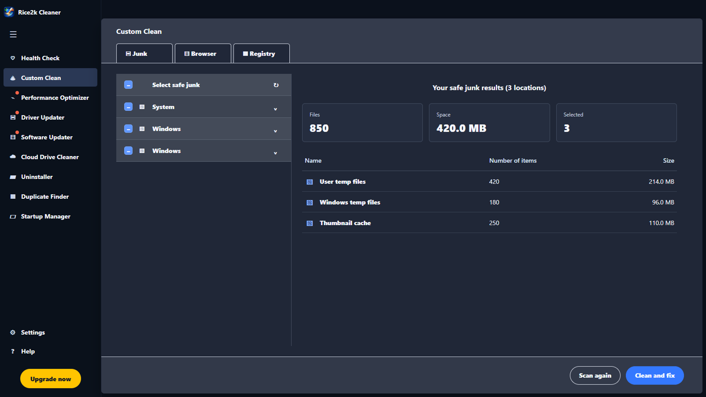
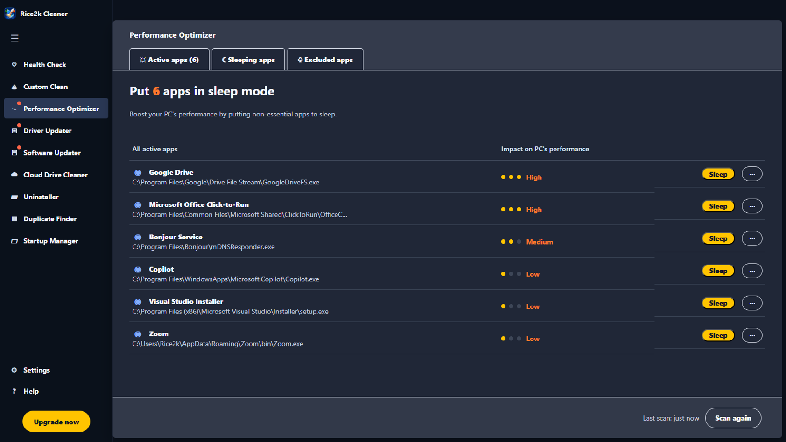
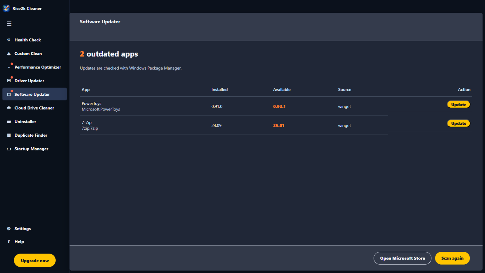
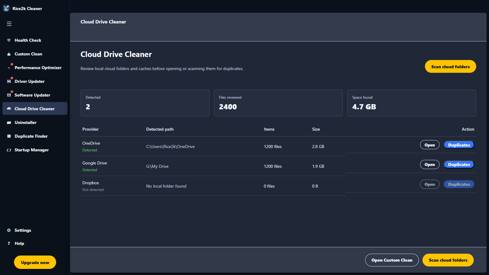

# Rice2k Computer Cleaner

Rice2k Computer Cleaner is a Windows desktop PC care app with a dark, scan-first workspace. The design is original, uses a custom Rice2k app icon, and keeps cleanup actions conservative.

## Features

- Health Check dashboard with PC health score and issue categories
- Custom Clean for safe junk scanning and cleanup
- Browser cache scanning for Edge, Chrome, and Firefox
- Performance Optimizer that lists heavy background apps and can put selected apps to sleep after confirmation
- Software Updater page powered by Windows Package Manager (`winget`) with per-app update buttons
- Driver Updater page that lists driver ages in review mode
- Startup Manager that lists Windows startup entries and opens Windows Startup settings
- Uninstaller page that lists and searches installed apps, then opens Windows Apps settings
- Duplicate Finder that hashes files, reports duplicate groups, and lets you open a duplicate location without deleting files
- Cloud Drive Cleaner page that reviews local OneDrive, Google Drive, and Dropbox folders/caches and can send a folder to Duplicate Finder
- Custom Windows app icon generated for Rice2k Computer Cleaner

## Safety model

The app only deletes safe cache and temp files that can be recreated by Windows or apps. It does not delete documents, downloads, cloud files, registry keys, drivers, installed apps, or duplicate files.

Software updates are launched through `winget` only after you click an app's Update button and confirm the prompt.

See [docs/SAFETY.md](docs/SAFETY.md) for the detailed cleanup boundaries.

## Screenshots











## Interface

- left sidebar navigation
- top strip with tabs where useful
- health score card
- issue tables with orange counts
- bottom action bar with scan and resolve buttons

## Requirements

- Windows 10 or Windows 11
- Node.js 22.12 or newer for development
- Windows Package Manager (`winget`) is optional and only needed for the Software Updater page

## Run from source

```powershell
npm install
npm start
```

## Build installer and portable app

```powershell
npm run portable
npm run dist
```

Portable and installer output appears in the `release` folder.

The first packaging run downloads `electron-builder` through `npx`.

## Development scripts

```powershell
npm run lint
```

The smoke test checks the required project files and verifies that the cleaner module loads.

## Project structure

```text
assets/       App icon PNG and ICO files
docs/         Safety notes
renderer/     HTML, CSS, and browser-side app UI
scripts/      Local checks
src/          Electron main process, preload bridge, and cleaner engine
```

## Notes

- Driver updates are review-only and route to Windows tools.
- App updates use `winget` after confirmation.
- Registry cleaning is intentionally not implemented.
- Duplicate finding is report-only.
- Cloud folder scanning is report-only.
- Some cleanup targets may skip locked files, which is normal while apps are running.
